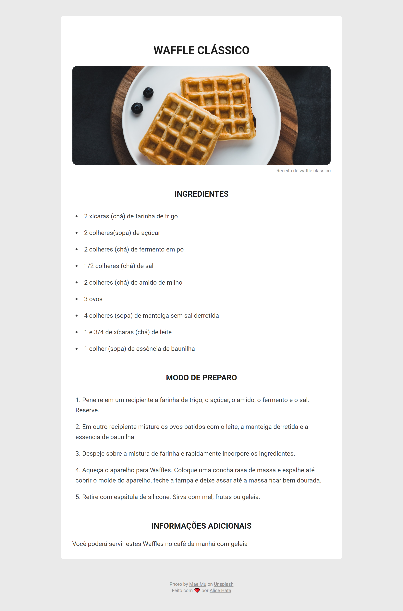

## Projeto

Neste desafio criado como sugestão da Rocketseat, devemos criar a estrutura HTML da página de receita, além de sua estilização.

**Requisitos para o desafio:**

- A receita deve ter um título.

- A receita deve ter uma imagem ilustrativa.

  - Adicione também uma legenda para a imagem.

- Cada lista deve ter um **subtítulo** (`Ingredientes` e `Modo de preparo`).

- Os ingredientes devem ser apresentados como uma **lista não ordenada** `<ul>`.

- O modo de preparo deve ser apresentado como uma **lista ordenada** `<ol>`.

- Deve ter uma seção `Informações adicionais` com um **parágrafo** com a **descrição da receita.**

- No final da receita deve ter um **rodapé** com seus créditos.

  - Pode direcionar o **link** para seu repositório do Github. (opcional)

**Cores**:

- Background da página: `#EAEAEA`;
- Background da receita: `#FFFFFF`;
- Títulos e subtítulos: `#1B1B1B`;
- Footer e legenda da imagem: `#8F8F8F`;
- Outros textos: `#39393A`;

**Tipografia:**

- A font usada foi a **Roboto** que pode ser encontrada no site do [Google Fonts](https://fonts.google.com/).

- Estamos usando um **font-weight** de 400 para os textos e 700 para os título e subtítulos.

- Título: `28px`;
- Subtítulos: `20px`;
- Listas e parágrafo(s): `16px`;
- Footer e legenda da imagem: `12px`;

- line-height nas listas de ingredientes e no modo de preparo: `26px`;
- Os títulos estão alinhados ao centro, bem como a imagem.
- A imagem do layout tem uma largura(width) de 100% e altura(height) de `250px`.
- A borda da image é arredondada com o valor de `10px`

<h1 align="center">
  
</h1>
